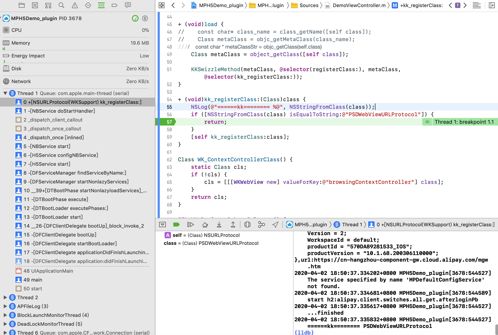
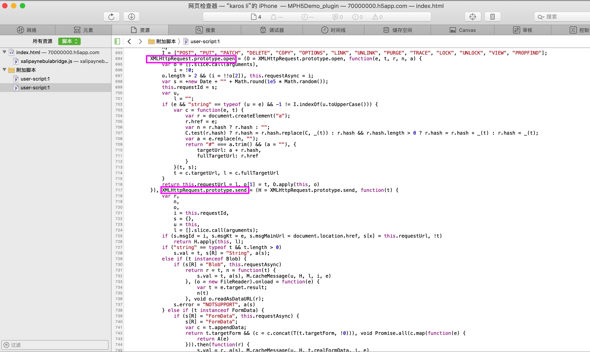

# WKWebView 离线包方案比较

## 方案列表
* 沙盒方案：通过沙盒路径直接加载本地文件
* NSURLProtocol 方案：基于 NSURLProtocol 进行全局请求拦截
* LocalServer 方案：搭建本地服务器加载本地资源
* WKURLSchemeHandler 方案：基于 WKURLSchemeHandler 进行自定义Scheme 注册拦截

## 方案图表比较
| 问题 | 沙盒 | NSURLProtocol | LocalServer | WKURLSchemeHandler |
| --- | --- | --- | --- | --- |
|  是否可以同步 Cookie | NO | YES | NO | NO（Session Cookie无效） |
|  是否有跨域问题 | YES | NO | YES | YES |
|  Ajax 是否完全可用 | NO | NO | YES | NO |
|  Fetch 是否完全可用 | NO | NO | YES | NO |
|  是否丢失 POST Body | NO | YES | NO | YES |
|  是否可以提交表单 | NO | NO | YES | NO |
|  是否必须使用 Ajax Hook | NO | YES | NO | NO |
|  是否必须使用 JSBridge 发送 API | YES | NO | NO | NO |
|  是否需要后台配置 CORS（跨域） | NO | NO | YES | YES |
|  是否可以获取期望的 window.location | NO | YES | NO | YES |
|  是否使用私有 API| NO | YES | NO | NO |
|  是否有系统限制 | NO | NO | NO | YES（iOS11以上） |
|  是否需要 H5 改造支持 | YES | NO | YES | YES |
|  是否需要请求是绝对路径 | NO | NO | YES | YES |
|  是否需要资源是相对路径 | YES | NO | YES | YES |
|  是否有后期维护成本 | NO | YES(Fetch Hook) | NO | NO |
|  方案成本 | 低 | 高 | 中 | 中 |
|  （H5不依赖Session Cookie）方案可行性 | 低 | 高 | 中 | 高 |
|  （H5不依赖window.location）方案可行性 | 低 | 高 | 高 | 中 |
|  全场景方案可行性 | 低 | 高 | 中 | 中 |

## 沙盒方案

## NSURLProtocol 方案

## LocalServer 方案

## WKURLSchemeHandler 方案

## 支付宝 mPaas 离线包方案（基于 WKWebView）探秘
实际上支付宝 `mPaas` 离线包方案是基于 `NSURLProtocol + Ajax Hook `来实现的。

### mPaas 的 NSURLProtocol
通过下图可以看到，在启动和打开离线包时，都会去注册 `PSDWebViewURLProtocol`，当阻止它注册时，在加载离线包的时候就会报加载失败。这里就可以说明 `资源拦截` 和 `虚拟域` 都是基于 `NSURLProtocol` 实现的。



### mPaas 的 Ajax Hook 
通过下图可以看到，实际上是 `Hook` 了 `Ajax` 的 `open` 和 `send` 方法。可以看到这里没有拦截 `get` 请求，这样就可以很好的兼容小游戏场景（通过 `Ajax Get` 获取的游戏资源，这些资源拦截不了）。



