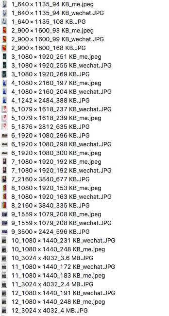

# 仿微信图片压缩方式

### 现状
目前公司 app 压缩图片，是压缩成一个固定大小的，比如把所有图片压缩成一个 120k 的图片，或者压缩成一个 300k的图片，这两种方式都不好，压缩成 120 会让原始图片质量太低，而显示模糊。

图片上传限定到 300k，也不是很对，这样会造成所有的图片都会以 300k 上传，这样会造成两个问题：
1. 上传速度会很慢，也比较耗流量。9 张图一起上传会更慢。
2. 300k 图片质量其实和 150k 左右的图片看起来差不多，过多的图片空间占用意义不大。

### 参考微信
因为发现微信的图片压缩后质量还不错，于是选择了 12 张不同大小不同尺寸的图片进行测试。

发现微信客户端上的图片压缩后，基本是 90k~200k 这个范围。

### 代码实现
本来一开始想试下鲁班算法，但是发现鲁班算法压缩后的图片大小跟微信的还是有些区别了，所以就放弃了。

于是参考微信，简单实现 iOS 压缩方式如下：

<!--more-->

```
+ (NSData *)smartCompressImage:(UIImage *)image {
    /** LUBAN 算法 **/
    // https://github.com/Curzibn/Luban/blob/master/library/src/main/java/top/zibin/luban/Engine.java
    //    int size = 1;
    //    float scale = ((float) shortSide / longSide);
    //    if (scale <= 1 && scale > 0.5625) {
    //        if (longSide < 1664) {
    //            size = 1;
    //        } else if (longSide >= 1664 && longSide < 4990) {
    //            size = 2;
    //        } else if (longSide > 4990 && longSide < 10240) {
    //            size = 4;
    //        } else {
    //            size = longSide / 1080 == 0 ? 1 : longSide / 1080;
    //        }
    //    } else if (scale <= 0.5625 && scale > 0.5) {
    //        size = longSide / 1080 == 0 ? 1 : longSide / 1080;
    //    } else {
    //        size = (int) ceil(longSide / (1080.0 / scale));
    //    }
    
    //    CGSize compressSize = CGSizeMake(width / size, height / size);
    
    //    CGFloat compression = 1.0;
    //    CGFloat maxCompression = 0.1;
    //
    //    //We loop into the image data to compress accordingly to the compression ratio
    //    NSData *imageData = UIImageJPEGRepresentation(image, compression);
    //    while ([imageData length] > 110 * 1024 && compression > maxCompression) {
    //        compression -= 0.10;
    //        imageData = UIImageJPEGRepresentation(image, compression);
    //    }
    //
    //    return imageData;
    
    /** 仿微信算法 **/
    int width = (int)image.size.width;
    int height = (int)image.size.height;
    int updateWidth = width;
    int updateHeight = height;
    int longSide = MAX(width, height);
    int shortSide = MIN(width, height);
    float scale = ((float) shortSide / longSide);
    
    // 大小压缩
    if (shortSide < 1080 || longSide < 1080) { // 如果宽高任何一边都小于 1080
        updateWidth = width;
        updateHeight = height;
    } else { // 如果宽高都大于 1080
        if (width < height) { // 说明短边是宽
            updateWidth = 1080;
            updateHeight = 1080 / scale;
        } else { // 说明短边是高
            updateWidth = 1080 / scale;
            updateHeight = 1080;
        }
    }
    
    CGSize compressSize = CGSizeMake(updateWidth, updateHeight);
    UIGraphicsBeginImageContext(compressSize);
    [image drawInRect:CGRectMake(0,0, compressSize.width, compressSize.height)];
    UIImage *compressImage = UIGraphicsGetImageFromCurrentImageContext();
    UIGraphicsEndImageContext();
    
    // 质量压缩 50%
    NSData *compressData = UIImageJPEGRepresentation(compressImage, 0.5);
    
    return compressData;
}

```

### 测试结果
总测试结果，基本上和微信的压缩结果比较接近了。


#### 图片一
原图：1_640 × 1135_108 KB


微信压缩：1_640 × 1135_94 KB_wechat


代码实现效果：1_640 × 1135_94 KB_me


#### 图片二
原图：2_900 × 1600_168 KB


微信：2_900 × 1600_99 KB_wechat


代码实现效果：2_900 × 1600_93 KB_me


#### 图片三
原图：3_1080 × 1920_269 KB


微信：3_1080 × 1920_255 KB_wechat


代码实现效果：3_1080 × 1920_251 KB_me


#### 图片四

原图：4_1242 × 2484_388 KB


微信：4_1080 × 2160_204 KB_wechat


代码实现效果：4_1080 × 2160_197 KB_me


#### 图片五

原图：5_1876 × 2812_635 KB


微信：5_1079 × 1618_237 KB_wechat


代码实现效果：5_1079 × 1618_239 KB_me


#### 图片六

原图：6_1920 × 1080_296 KB


微信：6_1920 × 1080_298 KB_wechat


代码实现效果：6_1920 × 1080_300 KB_me


#### 图片七

原图：7_2160 × 3840_677 KB


微信：7_1080 × 1920_192 KB_wechat


代码实现效果：7_1080 × 1920_192 KB_me


#### 图片八

原图：8_2160 × 3840_335 KB


微信：8_1080 × 1920_163 KB_wechat


代码实现效果：8_1080 × 1920_153 KB_me


#### 图片九

原图：9_3500 × 2424_596 KB


微信：9_1559 × 1079_208 KB_wechat


代码实现效果：9_1559 × 1079_208 KB_me


#### 图片十

原图：10_3024 x 4032_3.6 MB


微信：10_1080 × 1440_231 KB_wechat


代码实现效果：10_1080 × 1440_248 KB_me


#### 图片十一

原图：11_3024 x 4032_2.4 MB


微信：11_1080 × 1440_172 KB_wechat


代码实现效果：11_1080 × 1440_183 KB_me


#### 图片十二
原图：12_3024 x 4032_4 MB


微信：12_1080 × 1440_191 KB_wechat


代码实现效果：12_1080 × 1440_248 KB_me


### 参考
https://github.com/Curzibn/Luban/blob/master/DESCRIPTION.md
https://www.jianshu.com/p/5b77da571a5c?utm_campaign=maleskine
https://github.com/IcaliaLabs/UIImage-ImageCompress/blob/master/UIImage%2BImageCompress.m
https://github.com/hucool/WXImageCompress/blob/master/Pod/Classes/WXImageCompress.swift

